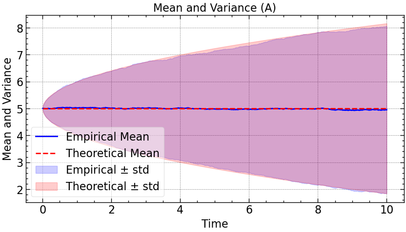
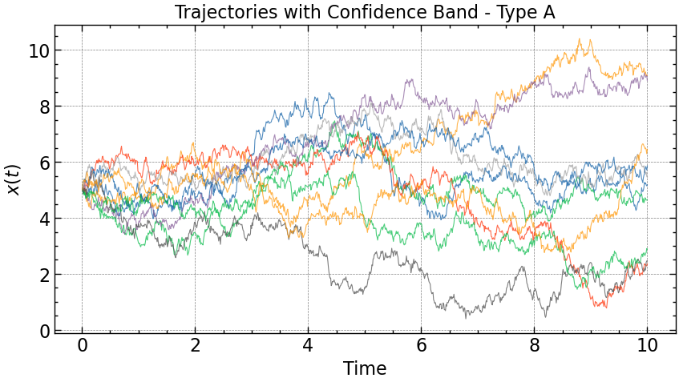
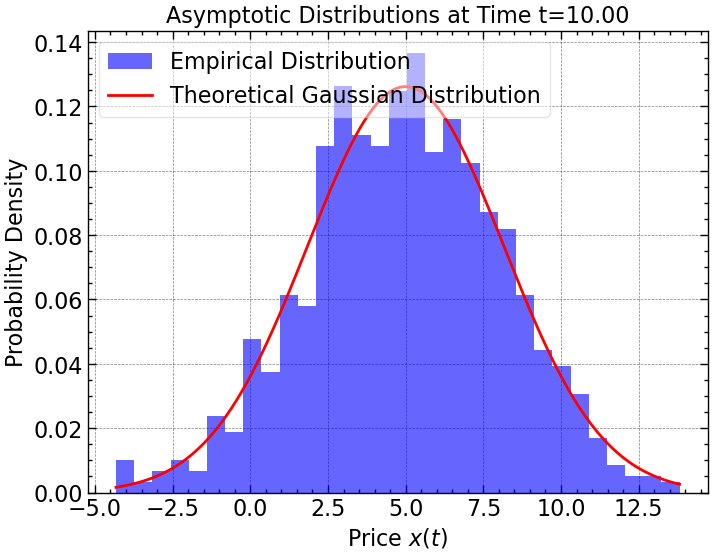

# RandomWalk Python Class

This Python class simulates various types of random walk processes. The class supports different types of random walks, each with unique characteristics and equations. It allows you to generate and analyze trajectories, plot the mean, variance, log-returns, and compare the empirical distributions to theoretical models.

## Features

### Type of Processes:
- **"A"**: Standard Brownian Motion: `dx(t) = dW(t)`
- **"B"**: Arithmetic Brownian Motion: `dx(t) = a*dt + b*dW(t)`
- **"C"**: Multiplicative Linear Process: `dx(t) = b * x(t) * dW(t)`
- **"D"**: Geometric Brownian Motion: `dx(t) = a*x(t) * dt + b*x(t) * dW(t)`
- **"E"**: Ornstein-Uhlenbeck Process: `dx(t) = -a(x(t) - μ) * dt + b*dW(t)`

### Main Methods:
- **generate()**: Generates the random walk trajectories.
- **plot_mean_variance()**: Plots the empirical and theoretical mean and variance.
- **plot_trajectories()**: Plots individual trajectories.
- **plot_log_returns()**: Plots the log-returns for processes of type C and D.
- **asymptotic_distributions()**: Compares empirical distributions with Gaussian distributions at a given time.
- **log_normal_distributions()**: Compares the empirical distribution of prices with a theoretical log-normal distribution for types C and D.

## Parameters:
- **Type**: Type of the random walk process ("A", "B", "C", "D", "E").
- **x0**: Initial value of the random walk.
- **N_traiettorie**: Number of trajectories to simulate.
- **Step_Temporali**: Number of time steps.
- **dt**: Time step size.
- **a**: Drift coefficient (used in types B, D, and E).
- **b**: Volatility (used in all types).
- **mu**: Stationary mean for the Ornstein-Uhlenbeck process (used in type E).


## Usage Example

```python
import RandomWalk

# Create a RandomWalk object with type "A" (Standard Brownian Motion)
rw = RandomWalk(Type="A", x0=5, N_traiettorie=1000, Step_Temporali=1000, dt=0.01, a=0.1, b=1, mu=0)

# Generate the random walk trajectories
rw.generate()

# Plot the results
rw.plot_mean_variance()
rw.plot_trajectories()
rw.plot_log_returns()  # Only for types C and D
rw.asymptotic_distributions()
```



```
Log-returns are only defined for types C and D.
```

